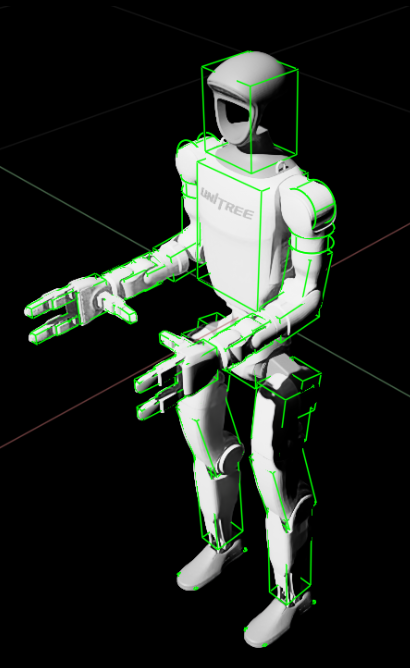

# simplify_urdf_collision

This git provides a script to simplify URDF collision models with optimal bounding boxes.

Installation
------------

you can install this as a catikin package or just run the script.

Python Dependencies (install using pip):
  - transforms3d
  - trimesh
  - numpy
  - pyyaml
  - scipy
  - lxml

You need to install urdf-parser-py manually since the pip package is not maintained:

```
git clone git@github.com:ros/urdf_parser_py.git
cd urdf_parser_py
pip install .
```
depending on your pip configuration you may need to use the `--user` option.


Run and usage
-------------

Run the script with -h to get the usage options.

```python src/simplify_urdf_collision/simplify.py -h```

-------------

# Use example on Unitree G1 humanoid:
```bash
python src/simplify_urdf_collision/simplify.py g1_29dof_with_hand_rev_1_0.urdf g1_29dof_with_hand_rev_1_0_simplified.urdf --scale 0.77 --verbose --bbox-type obb --tight-fit
```

After this, some manual adjustions might still be needed.



# Enhanced Collision Simplification Usage Examples

The improved `simplify.py` script now provides much better control over bounding box fitting. Here are some common usage patterns:

## Basic Usage (same as before)
```bash
python simplify.py input.urdf output.urdf
```

## Scaling Examples

### Make boxes 10% larger in all dimensions
```bash
python simplify.py input.urdf output.urdf --scale 1.1
```

### Make boxes narrower in X direction, taller in Z direction
```bash
python simplify.py input.urdf output.urdf --scale-x 0.8 --scale-z 1.2
```

## Padding Examples

### Add 1cm padding to all dimensions
```bash
python simplify.py input.urdf output.urdf --padding 0.01
```

### Add different padding per axis (useful for elongated objects)
```bash
python simplify.py input.urdf output.urdf --padding-x 0.005 --padding-y 0.005 --padding-z 0.02
```

## Bounding Box Type Examples

### Use axis-aligned bounding boxes (simpler, but often larger)
```bash
python simplify.py input.urdf output.urdf --bbox-type aabb
```

### Use oriented bounding boxes with tight fitting (default, usually better)
```bash
python simplify.py input.urdf output.urdf --bbox-type obb --tight-fit
```

## Combined Examples

### Conservative approximation: 20% larger boxes with 5mm padding
```bash
python simplify.py input.urdf output.urdf --scale 1.2 --padding 0.005
```

### Tight approximation for precision applications
```bash
python simplify.py input.urdf output.urdf --tight-fit --scale 1.05 --min-size 0.0005
```

### Custom per-axis scaling for hand/gripper models
```bash
python simplify.py input.urdf output.urdf --scale-x 1.1 --scale-y 1.1 --scale-z 0.9 --padding 0.002
```

## Debugging and Analysis

### Verbose output to see volume ratios and detailed info
```bash
python simplify.py input.urdf output.urdf --verbose
```

### Interactive mode to selectively process collision models
```bash
python simplify.py input.urdf output.urdf --select --verbose
```

### Exclude specific links from processing
```bash
python simplify.py input.urdf output.urdf --exclude base_link sensor_link
```

## ROS Integration

### Process ROS package URDFs with enhanced control
```bash
python simplify.py input.urdf output.urdf --ros --scale 1.1 --padding 0.01
```

## Understanding the Parameters

- **`--scale`**: Uniform scaling factor for all dimensions (1.0 = original size)
- **`--scale-x/y/z`**: Per-axis scaling (overrides uniform scale)
- **`--padding`**: Uniform padding in meters added to all dimensions
- **`--padding-x/y/z`**: Per-axis padding in meters (overrides uniform padding)
- **`--bbox-type`**: 
  - `obb` (default): Oriented bounding box - rotated to fit shape better
  - `aabb`: Axis-aligned bounding box - simpler but often larger
- **`--tight-fit`**: Use convex hull for potentially tighter fitting
- **`--min-size`**: Minimum dimension size (prevents degenerate boxes)
- **`--verbose`**: Show detailed information including volume ratios

## Tips for Better Results

1. **For robot hands/grippers**: Use smaller scaling (1.05-1.1) with small padding
2. **For safe collision checking**: Use larger scaling (1.2-1.5) with generous padding  
3. **For visualization/display**: Tight fit with minimal scaling works well
4. **For complex shapes**: Try `--tight-fit` option for better approximation
5. **For debugging**: Always use `--verbose` to see volume ratios and understand fit quality

The volume ratio shown in verbose mode indicates how much larger the bounding box is compared to the original mesh volume. Lower ratios (closer to 1.0) indicate tighter fits.
