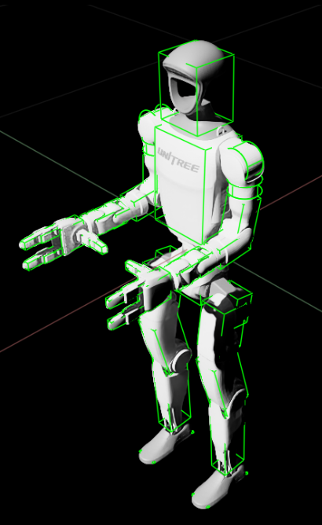

# simplify_urdf_collision

Replace mesh-based URDF collision geometries with simple bounding primitives
(box, sphere, cylinder). The tool automatically picks the best primitive per
link, or you can force a specific type globally or per-link via a YAML config.

## Quick start

The project uses [pixi](https://pixi.sh/) to manage a fully isolated Python
environment -- nothing is installed system-wide.

```bash
# Install the environment (one-time)
pixi install

# Run the simplifier (pixi sets PYTHONPATH automatically)
pixi run simplify input.urdf output.urdf [options]
```

If you prefer running Python directly:

```bash
PYTHONPATH=src pixi run python -m simplify_urdf_collision.simplify input.urdf output.urdf
```

## Usage

```
pixi run simplify -h
```

### Basic examples

```bash
# Auto-detect best primitive per link (default)
pixi run simplify input.urdf output.urdf

# Force all collisions to boxes (original behavior)
pixi run simplify input.urdf output.urdf --primitive-type box

# Use oriented bounding boxes with tight fitting
pixi run simplify input.urdf output.urdf --primitive-type box --bbox-type obb --tight-fit

# Verbose output
pixi run simplify input.urdf output.urdf --verbose
```

### Unitree G1 humanoid example

```bash
pixi run simplify g1_29dof_with_hand_rev_1_0.urdf g1_simplified.urdf \
    --scale 0.77 --verbose --bbox-type obb --tight-fit
```



## Primitive types

| Flag | Description |
|------|-------------|
| `--primitive-type auto` | (default) Automatically picks box, sphere, or cylinder per link |
| `--primitive-type box` | Bounding box for every link (original behavior) |
| `--primitive-type sphere` | Bounding sphere for every link |
| `--primitive-type cylinder` | Bounding cylinder for every link |

The auto-detection analyses each mesh's aspect ratios, sphericity, and
cross-section circularity to pick the tightest-fitting primitive.

## Scaling and padding

```bash
# Uniform 10% larger
pixi run simplify input.urdf output.urdf --scale 1.1

# Per-axis scaling
pixi run simplify input.urdf output.urdf --scale-x 0.8 --scale-z 1.2

# Add 1 cm padding everywhere
pixi run simplify input.urdf output.urdf --padding 0.01

# Per-axis padding
pixi run simplify input.urdf output.urdf --padding-x 0.005 --padding-z 0.02
```

## Per-link YAML config

For fine-grained control, pass `--config config.yaml`. This lets you set
defaults and per-link overrides so you can tune once and re-run
deterministically instead of editing the output URDF by hand.

```yaml
defaults:
  primitive_type: auto
  scale: 1.1
  padding: 0.005

overrides:
  pelvis_contour_link:
    primitive_type: box
    scale: 1.2
  left_knee_link:
    primitive_type: cylinder
    padding: 0.01
  head_link:
    primitive_type: sphere
```

Supported per-link keys: `primitive_type`, `bbox_type`, `scale`, `scale_x`,
`scale_y`, `scale_z`, `padding`, `padding_x`, `padding_y`, `padding_z`,
`min_size`, `tight_fit`.

```bash
pixi run simplify input.urdf output.urdf --config config.yaml --verbose
```

## All CLI options

| Flag | Default | Description |
|------|---------|-------------|
| `--primitive-type` | `auto` | Primitive type: `auto`, `box`, `sphere`, `cylinder` |
| `--config` | — | YAML config file with per-link overrides |
| `--scale` | `1.0` | Uniform scaling factor |
| `--scale-x/y/z` | — | Per-axis scaling (overrides `--scale`) |
| `--padding` | `0.0` | Uniform padding in meters |
| `--padding-x/y/z` | — | Per-axis padding in meters |
| `--bbox-type` | `obb` | `obb` (oriented) or `aabb` (axis-aligned) |
| `--tight-fit` | off | Use convex hull for tighter fitting |
| `--min-size` | `0.001` | Minimum dimension in meters |
| `-e`, `--exclude` | — | Link names to skip |
| `-s`, `--select` | off | Interactive mode to deselect links |
| `-r`, `--ros` | off | Resolve `package://` paths |
| `-v`, `--verbose` | off | Print per-link details |

## Tips

1. **Start with `--primitive-type auto`** -- it picks the right shape for most links.
2. **Use `--config`** for repeatable per-link tuning instead of hand-editing the URDF.
3. **For robot hands/grippers**: small scaling (1.05-1.1) with small padding.
4. **For safe collision checking**: larger scaling (1.2-1.5) with generous padding.
5. **Always use `--verbose`** when iterating to see what primitive and dimensions each link gets.

## Legacy notes

The repo still contains `CMakeLists.txt`, `package.xml`, `setup.py`, and
`src/optimal_bounding_box.cpp` from the original ROS/catkin packaging. These
are not used by the pixi-based workflow and can be safely ignored or removed.

## License

MIT -- see [LICENSE](LICENSE).
